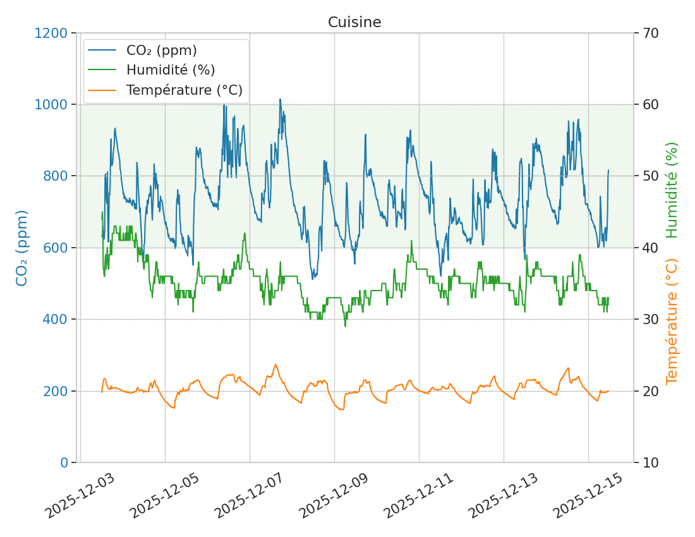

# PlotAir

PlotAir is a Python script that processes one or more CSV files containing [VisiblAir](https://visiblair.com/) sensor data. For each file, it reads the data into a [pandas](https://github.com/pandas-dev/pandas) DataFrame, ignores incorrectly formatted lines, keeps only the most recent data sequence, and generates a [Seaborn](https://github.com/mwaskom/seaborn) plot saved as a PNG file with the same base name as the input CSV.

## Installation

PlotAir has been developped with Python 3.11 but may work with older versions. You can check your version with the `python3 --version` or `python --version` command. Only a few external libraries are required.

### Install Dependencies

PlotAir depends on the [pandas](https://github.com/pandas-dev/pandas) and [seaborn](https://github.com/mwaskom/seaborn) libraries and their dependencies. It is recommended to install them within a [virtual environment](https://docs.python.org/3/tutorial/venv.html).

Note that the following instructions have only been tested on Linux. On Windows you may need to use the `python` and `pip` commands instead of `python3` and `pip3`.

1.  **Create a virtual environment** in a directory of your choice:
    
    ```bash
    python3 -m venv plotair-env
    ```
    
2.  **Activate the virtual environment**:

	On Linux and macOS:
    ```bash
    source plotair-env/bin/activate
    ```
    On Windows:
    ```bash
    plotair-env\Scripts\activate
    ```

3.  **Install the required libraries**:
    
    ```bash
    pip3 install pandas seaborn
    ```

After installing the dependencies, you are ready to download and run PlotAir.

## Usage

### Basic Usage

On Linux you should be able to run PlotAir directly if its location is in your path:

```bash
plotair.py <file1> <file2> ...
```

Otherwise you can run it with Python:

```bash
python3 plotair.py <file1> <file2> ...
```

### Command-Line Arguments

None for now.

## Configuration

You can edit the configuration constants directly at the top of the plotair.py file if you wish to change the default behavior. For example you can translate the labels of the plot to the language of your choice and you can change the colors of the lines.

## License

Copyright (c) 2026 Monsieur Linux

This project is licensed under the MIT License. See the [LICENSE](LICENSE) file for details.

## Acknowledgements

Thanks to the creators and contributors of the [pandas](https://github.com/pandas-dev/pandas) and [seaborn](https://github.com/mwaskom/seaborn) libraries, and to the developer of the great [VisiblAir](https://visiblair.com/) air quality monitors and CO₂ sensors. Thanks also to the founder of [Bâtiments vivants](https://batimentsvivants.ca/) for the idea of this script.
